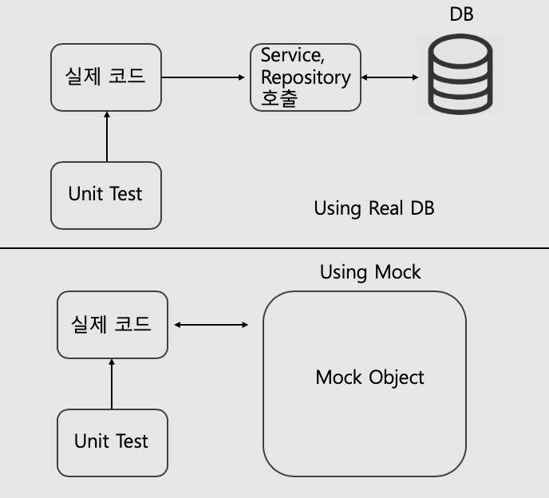
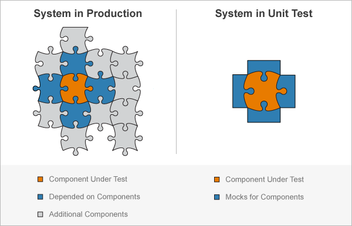

# Web-Server Platform Sample (Golang 1.16)

Go 언어를 이용한 웹서버 샘플  

## 개요  
---
설계 바탕이 된 레이어 구조, 적용 예, Test 까지를 다룬다. 

## Layered Architecture
---
레이어라는 말에서 알 수 있듯 각 레이어(계층)는 동일한 관심사(역할)의 집합으로 이루어져 있고, 
겹겹이 쌓아 올린 구조라는 것을 알 수 있을 것 입니다. 그리고 이 계층 구조가 의미하는 
다른 부분을 생각해 본다면 계층 간 접근/제어에 대한 부분으로 하위(종속) 계층으로만 
컨트롤될 수 있도록 하는 설계 단계에서부터의 제한이라고 볼 수 있습니다.   
예를 들어 상위 계층에서 하위 계층으로 접근은 가능하지만 하위 계층에서 상위 계층으로의 
조작 코드는 작성하면 안 됩니다.  

각 레이어를 분리하고 각 레이어의 역할을 구체화해 규칙을 준수한다면, 
기능/사람의 변경에도 유연하게 대처할 수 있어 어려움(비용)이 줄어들 수 있을 것 입니다.  

### Software Architecture is The Art Of Drawing Lines That I Call Boundaries. - 로버트C. 마틴  
---
소프트웨어 아키텍처는 경계라는 선을 그리는 예술이다. 이러한 경계들은 소프트웨어 요소들을 서로 
분리하고 디펜던시 의존성을 제한한다. 아키텍트의 목표는 필요한 시스템을 구축하고 유지하는 데 
필요한 인적 리소스를 최소화하는 것이다. 예를 들어서, 비즈니스 유스케이스와 데이터베이스 사이의 
경계선을 그릴 수 있다. 그 선은 비즈니스 규칙이 데이터베이스에 대해 전혀 알지 못하도록 막았다. 
그 결정은 데이터베이스의 선택과 실행을 뒤로 늦출 수 있었고, 데이터베이스에 의존한 문제가 
발생하지 않았다. 중요한 것과 중요하지 않은 것 사이에 선을 긋는다. UI는 비즈니스 규칙에 영향을 
미치지 않아야 하고, 데이터베이스는 UI에 영향을 미치지 않아야 한다. 물론, 대부분의 우리들은 
데이터베이스는 비즈니스 규칙과 불가피하게 연결되어 있다고 믿고 있다. 하지만, 데이터베이스는 
비즈니스 규칙이 간접적으로 사용할 수 있는 도구일 뿐이다. 그래서, 우리는 인터페이스 뒤에 
데이터베이스를 놓을 수 있도록 설계를 해야 한다. 실제로 소프트웨어 개발, 기술의 역사는 확장 
가능하고 유지 관리 가능한 시스템 아키텍처를 구축하기 위해 플러그인을 만드는 방법에 관한 
이야기이다. 핵심 비즈니스 규칙은 다른 컴포넌트들과 독립적으로 유지된다.  - 로버트 C. 마틴

## layered Architecture의 적용  
---
* 3tier Architecture : Clean architecture  
	전자정부 프레임워크로 국내에서 가장 많이 사용하는 구조  
	- presentation layer  
      controllers 폴더  
	- business layer  
      services 폴더  
	- data access layer  
      repositories폴더  
* Presentation layer  
	HTTP Framework(Echo, Gin?)로부터 최초로 호출되는 API엔드 포인트  
	- 클라이언트에서 보내온 데이터의 변환(Param Data)  
	- 기본적인 인증과 요청 내용 검증  
	- 수행 결과를 클라이언트에 반환  
* Business layer   
	- 비즈니스 로직을 작성한다.  
* Data access layer   
	- 데이터(데이터 정책(Unique, Max, Min))과 관련된 비즈니스 로직(메서드)  
* Entities => model 폴더  
    - 레이어 전체에서 사용되는 데이터의 구조  
    - 메서드를 포함하는 객체일 수도 있고, 단순 데이터 구조일 수도 있다.  
* Infrastructure ( Framework Drivers )  
	- 이 영역은 일반적으로 데이터베이스 및 웹 프레임워크와 같은 도구로 구성된다. 
	- HTTP Framework : Server  
	- Database(ORM) : datastore  
	- ETC...  

참고용 그림( 이 프로젝트 코드와 관계는 없다. )


## 클린 아키텍처, 디펜던시 의존성  
---
클린 아키텍처에서 가장 중요한 개념은 디펜던시(의존성) 규칙이다.  
우리는 이 문서에서 설명한 계층 외 추가 계층을 필요로 할 수 있다. 그러나, 디펜던시 규칙은 항상 
적용이 된다. 규칙을 준수하는 것은 어렵지 않으며, 앞으로 많은 고민들을 해결해 줄 것이다. 
소프트웨어를 계층으로 분리하고, 디펜던시 규칙을 준수함으로써, 데이터베이스나 웹 프레임워크와 같은 
시스템이 외부 부분들이 쓸모없게 될 때, 그러한 쓸모없는 요소들을 최소한의 작업으로 대체할 수 있을 것이다. 

### 예제코드와 설명  
---
만약 데이터 베이스내 데이터를 읽어 응답까지 전달하는 기능이 필요하다면 
프레젠테이션에서 데이터까지 경로가 필요할 것입니다.  
이 기능을 위한 각 계층을 어떻 구성하는지 예제로 알아보도록 하겠습니다.  

1. Model  
데이터 설계  
	```go
	// Todo ....
	type Todo struct {
		ID      int
		Title   string
		Content string
		Status  string
	}
	```
2. Controller(Presentation) => UseCase  
	Usecase, 생성자, 그리고 엔드포인트(메서드)를 작성한다.  
	```golang
	// TodoController todo controller
	type TodoController struct {
		Usecase TodoUsecase
	}

	// TodoUsecase Todo Usecase
	type TodoUsecase interface {
		GetByID(string) (*model.Todos, error)
	}
			
	// New create Todo instance.
	func (TodoController) New(usecase TodoUsecase) *TodoController {
		return &TodoController{Usecase: usecase}
	}       
			
	// GetByID return todos whoes ID mathces
	func (todo *TodoController) GetByID(c echo.Context) error {
		inputID := c.Param("id")
		todo, err := todo.Usecase.GetByID(inputID)
		if err != nil {
			return c.JSON(http.StatusInternalServerError, err)
		}
		return c.JSON(http.StatusOK, todo)
	}       
	```
	ID를 기반으로 조회하는 서비스를 직접 호출하여 처리할 수도 있다. 그러나 직접 호출하지는 않는다.  

3. Service -> Repository Usecase  
	서비스는 Controller - Usecase의 구현체이자 Repository - Usecase를 가진다.  
	```golang
	// Todoservice todo service 
	type TodoService struct {
		Repository TodoRepository
	}

	// TodoRepository todo repository usecase
	type TodoRepository interface {
		FindByID(string) (*model.Todos, error)
	}

	// New is constructor that creates Todoservice
	func (TodoService) New(repo TodoRepository) *TodoService {
		return &TodoService{Repository: repo}
	}

	// GetByID returns todo whoes that ID mathces.
	func (todo *TodoService) GetByID(id string) (*model.Todos, error) {
		return todo.FindByID(id)
	}
	```

4. Repository -> Infra  
	Repository Usecase의 구현체  
	```go
	// TodoRepository todo repository infra의존성을 가진다.  
	type TodoRepository struct {
		*datastore.DataStore
	}

	// New is constructor that creates TodoRepository
	func (TodoRepository) New(ds *datastore.DataStore) *TodoRepository {
		return &TodoRepository{ds}
	}   

	// FindByID will return todo whoes ID mathces
	func (repo *TodoRepository) FindByID(id string) (todos *model.Todos, err error) {
		result := repo.Orm.Where("ID = ?", id).Find(&todos)
		if result.Error != nil {
			// 
		}
		if result.RowsAffected <= 0 {
			// 
		}
		return result, nil
	}   
	```

5. 참고  
참고용 그림  


	위와 같이 상위 계층은 UseCase를 통해 하위 계층을 잘 알고 있어야 하지만 
	UseCase를 구현하는 하위 계층에서는 기능 구현에 초점이 맞추어지며 상위 계층에 대해서 
	인지하지 않게 된다. 그리고 Golang 특성 상 이런 구조로 작성 시 각 레이어(패키지 디렉토리)에서 
	다른 계층(패키지) Import가 발생하지 않는다.  

### Hierarchy  
---
각 레이어의 연결은 Hierarchy로 불리는 패키지 내에서 각 레이어를 연결하고 관리할 수 있도록 한다.  
```go
package hierarchy

import (
    "github.com/jblim0125/golang-web-platform/controllers"
    "github.com/jblim0125/golang-web-platform/repositories"
    "github.com/jblim0125/golang-web-platform/services"
)

// Todo ...
type Todo struct {
}

// Init for interconnection [ controller - Service - repository - datastore ]
func (Todo) Init(h *Hierarchy) *controllers.TodoController {
    // 상위 계층 Usecase에 대응하는 구현체를 생성하고 초기화 하는 과정       
    repo := repositories.Todo{}.New(h.Datastore)
    svc := services.Todo{}.New(repo)
    controller := controllers.Todo{}.New(svc)
    return controller 
}
```

### 예제에서 다루지 않은 내용  
---
위 코드의 추가만으로 이 샘플을 즉시 사용할 수는 없다. Database Migration, 
Path Route 설정이 추가되어야 한다. 
이 문서에는 구조적인 부분의 설명을 위함이므로, 생략되었음을 알립니다.  

## Test  
---
테스트는 단위 테스트와 통합 테스트로 구분하고, 필요한 interface에 대해서는 mock을 이용해 처리한다.  

* 단위 테스트  
	설계 단계에서 우리는 관심사(업무)별 계층을 분리하고 인터페이스로 실 구현체와의 연결성을 제거하였다. 
	그러나 아래 그림과 같이 유닛 테스트를 진행 시 service, repository 객체가 필요하다. 
	
	위와 같은 문제를 mockery를 이용해 자동으로 mock 생성하여 처리한다.  
	mockery는 각 객체에서 정의한 의존성(type xxx interface{})내용을 기반으로 mock을 생성하며, 
	mock object 설정을 이용해 원하는 결과를 반환하도록 설정이 가능하다.  
	( 즉, 테스트에 필요한 반환 값은 작성해야 한다. )
	결국 아래와 같이 의존성 부분을 mock으로 대체하고 원하는 코드의 테스트가 가능해진다.  
	  

* mockery 사용 방법  
	- install mockery  
	```bash
	$ sudo su 
	$ go get github.com/vektra/mockery/v2/.../
	```
	- mock 생성  
	all 명령을 이용한 소스 전체 mock 생성  
	```bash
	$ mockery --all --keeptree
	```
	- 특정 interface의 mock 생성  
	```bash
	$ mockery --dir {path} --name {name of interface} --keeptree
	```
* Unit Test Sample  

### 통합테스트
```
고랭 testing과 echo(controller 사용을 위해)를 사용하여 테스트하며
영속성 계층이 의존하는 db만(직접 mock을 생성해 변경), 주입하여 테스트한다.

모든계층을 테스트 할 수 있으며, db만 같다면 실제 운영환경과 같은 환경으로 테스트가 가능하다.
(운영환경과 db까지 같은환경을 원한다면 db도 변경없이 테스트한다.)

원하는 계층의 mock을 직접 생성하면 단위테스트도 할 수있지만
 
mock객체 생성은 mockery 라이브러리를 이용한다. 
```

## Sonarqube  
- sonarqube config 파일
```
#Configure here general information about the environment, such as SonarQube server connection details for example
#No information about specific project should appear here

#----- Default SonarQube server
sonar.host.url=http://192.168.102.127:9000/
sonar.login=2a09a7d77a7c54c94b33b5a7270b30907d023127

# #----- Default source code encoding
sonar.sourceEncoding=UTF-8

sonar.projectKey=golang-echo-sample
sonar.projectName=golang-echo-sample
# sonar.projectVersion=1.0
sonar.language=go
sonar.sources=.
sonar.exclusions=**/mock/**,**/secret/**,**/docs/**,**/data/**,.idea/**,**/vendor/**
sonar.sourceEncoding=UTF-8
sonar.tests=.
sonar.test.inclusions=**/*_test.go
sonar.test.exclusions=**/vendor/**
sonar.go.coverage.reportPaths=**/coverage.out
```
- 명령어
```bash
$ go test -v ./... -coverprofile=coverage.out
$ go test -v ./... -json > report.json
$ sonar-scanner
```
