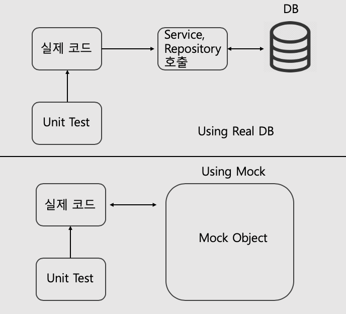
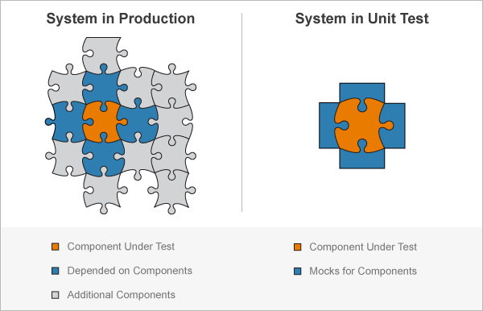

# Test 
테스트는 단위 테스트와 통합 테스트로 구분하고, 필요한 interface에 대해서는 mock을 이용해 처리한다.  

* 단위 테스트  
	설계 단계에서 우리는 관심사(업무)별 계층을 분리하고 인터페이스로 실 구현체와의 연결성을 제거하였다. 
	그러나 아래 그림과 같이 유닛 테스트를 진행 시 service, repository 객체가 필요하다. 
	
	위와 같은 문제를 mockery를 이용해 자동으로 mock 생성하여 처리한다.  
	mockery는 각 객체에서 정의한 의존성(type xxx interface{})내용을 기반으로 mock을 생성하며, 
	mock object 설정을 이용해 원하는 결과를 반환하도록 설정이 가능하다.  
	( 즉, 테스트에 필요한 반환 값은 작성해야 한다. )
	결국 아래와 같이 의존성 부분을 mock으로 대체하고 원하는 코드의 테스트가 가능해진다.  
	  

* mockery 사용 방법  
	- install mockery  
	```bash
	$ sudo su 
	$ go get github.com/vektra/mockery/v2/.../
	```
	- mock 생성  
	all 명령을 이용한 소스 전체 mock 생성  
	```bash
	$ mockery --all --keeptree
	```
	- 특정 interface의 mock 생성  
	```bash
	$ mockery --dir {path} --name {name of interface} --keeptree
	```
* Unit Test Sample  

### 통합테스트
```
고랭 testing과 echo(controller 사용을 위해)를 사용하여 테스트하며
영속성 계층이 의존하는 db만(직접 mock을 생성해 변경), 주입하여 테스트한다.

모든계층을 테스트 할 수 있으며, db만 같다면 실제 운영환경과 같은 환경으로 테스트가 가능하다.
(운영환경과 db까지 같은환경을 원한다면 db도 변경없이 테스트한다.)

원하는 계층의 mock을 직접 생성하면 단위테스트도 할 수있지만
 
mock객체 생성은 mockery 라이브러리를 이용한다. 
```

## Sonarqube  
- sonarqube config 파일
```
#Configure here general information about the environment, such as SonarQube server connection details for example
#No information about specific project should appear here

#----- Default SonarQube server
sonar.host.url=http://192.168.102.127:9000/
sonar.login=2a09a7d77a7c54c94b33b5a7270b30907d023127

# #----- Default source code encoding
sonar.sourceEncoding=UTF-8

sonar.projectKey=golang-echo-sample
sonar.projectName=golang-echo-sample
# sonar.projectVersion=1.0
sonar.language=go
sonar.sources=.
sonar.exclusions=**/mock/**,**/secret/**,**/docs/**,**/data/**,.idea/**,**/vendor/**
sonar.sourceEncoding=UTF-8
sonar.tests=.
sonar.test.inclusions=**/*_test.go
sonar.test.exclusions=**/vendor/**
sonar.go.coverage.reportPaths=**/coverage.out
```
- 명령어
```bash
$ go test -v ./... -coverprofile=coverage.out
$ go test -v ./... -json > report.json
$ sonar-scanner
```

